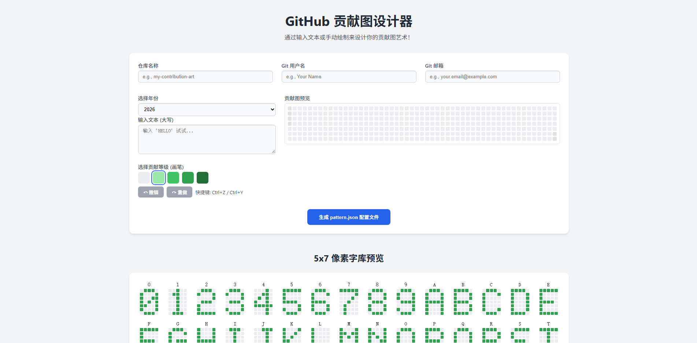

# GitHub Contribution Art Generator



> 交互式 7×53 贡献图设计器：在网页端点击/拖拽绘制（或输入文本）、导出 `pattern.json`，一键生成可推送的 Git 仓库。

[中文](#中文) | [English](#english)

---

<a name="中文"></a>

## 中文

一个可以通过生成具有特定提交历史的仓库，从而在你的 GitHub 贡献图上“作画”的工具集。

本项目包含两个核心部分：
1.  **`index.html`**: 一个完全离线的、可交互的前端网页，用于可视化地设计你的贡献图图案。
2.  **`repo_generator.py`**: 一个 Python 脚本，它会读取图案文件，并通过调用你系统上已安装的 Git 来生成一个 Git 仓库。

### 功能特性

* **可视化设计器**: 提供一个 7x53 的网格，与 GitHub 贡献图精确对应。
* **文本转艺术**: 使用内置的 5x7 字体，自动将文本转换为贡献图上的像素图案。
* **手动绘制**: 通过点击和拖动鼠标，在网格上微调你的设计。
* **年份选择**: 可以选择特定的年份来创作你的贡献图艺术。
* **撤销 / 重做**: 支持多次撤销与重做，快捷键为 `Ctrl+Z` / `Ctrl+Y`（输入框时不触发）。
* **智能提示**: 对不支持的字符、文本超长、零等级画笔等情况给出即时提示。
* **安全导出**: 导出前校验仓库名（仅字母、数字、`.`、`_`、`-`，禁止 `..`/斜杠/空格）、邮箱格式与非空图案。
* **零依赖**: 网页完全离线运行，Python 脚本仅需要一个标准的 Python 环境和系统已安装的 Git。

### 使用方法

#### 第一步：设计你的图案

1.  在你的浏览器中打开 `index.html` 文件。
2.  **选择年份**: 从下拉菜单中选择目标年份。不属于该年份的单元格将被禁用。
3.  **输入文本 (可选)**: 在输入框中键入任意文本，可以快速生成一个基础图案。
4.  **手动绘制**: 从调色板中选择一个贡献等级（颜色），然后在网格上点击或拖动鼠标来自定义你的设计。

#### 第二步：生成配置文件

1.  填写你想要的 **仓库名称**、你的 **Git 用户名** 和 **Git 邮箱**。
2.  点击 **“生成 pattern.json 配置文件”** 按钮。
3.  你的浏览器将会下载一个名为 `pattern.json` 的文件。

#### 第三步：运行 Python 脚本

1.  将下载的 `pattern.json` 文件与 `repo_generator.py` 脚本放置在同一个目录下。
2.  打开你的终端或命令提示符，进入该目录，并运行脚本：
    ```bash
    python repo_generator.py            # 读取 ./pattern.json
    python repo_generator.py path/to/pattern.json        # 指定配置文件路径
    python repo_generator.py path/to/pattern.json --force   # 追加到已有同名仓库
    ```
3.  脚本会读取配置，并生成一个包含伪造提交历史的新文件夹（即你的仓库）。
    * **`-h` / `--help`** 打印用法（中文）并以 `0` 退出。
    * **`--force`** 允许在已有同名仓库基础上追加提交，而非直接中止。
    * 未安装 `git`、JSON 非法、日期格式错误、图案行不一致或使用了未定义的等级字符，
      均会给出友好提示并以 `1` 退出（不会抛出原始 Python 异常）。

#### 第四步：推送到 GitHub

#### 第四步：推送到 GitHub

1.  前往 [GitHub](https://github.com) 并创建一个 **新的、空的仓库**。不要勾选“添加 README”、“添加 .gitignore” 或选择任何许可证。
2.  遵循脚本在终端里打印出的指引，将本地生成的仓库推送到 GitHub。指令会类似如下：

    ```bash
    # 进入你新创建的仓库目录
    cd 你的仓库名称

    # 将其关联到远程 GitHub 仓库
    git remote add origin <你的远程仓库URL>

    # 将分支重命名为 main
    git branch -M main

    # 将你的提交历史推送到 GitHub
    git push -u origin main
    ```

稍等片刻，你的新贡献图艺术就会出现在你的 GitHub 个人主页上！

P.S. 本项目的主旨是尽可能少的依赖, 确保开箱即用. 因此后续演进其他功能需要耗费比较长的时间.

todo:
1.  支持更多的自定义配置, 比如颜色, 字体, 间距等等.
2.  支持更多的交互方式, 比如拖动选择区域, 复制粘贴, 撤销重做等等.
3.  支持更多的输出格式, 比如 SVG, PNG, GIF 等等.
4.  支持更多的输入格式, 比如图片, CSV等等.

---

<a name="english"></a>

## English

A toolset to "draw" on your GitHub contribution graph by generating a repository with a specific commit history.

This project consists of two main parts:
1.  **`index.html`**: A fully offline, interactive web page for designing your contribution pattern visually.
2.  **`repo_generator.py`**: A Python script that reads the pattern file and generates a Git repository by calling your system's installed Git.

### Features

* **Visual Designer**: A 7x53 grid to precisely match the GitHub contribution graph.
* **Text to Art**: Automatically convert text into pixel art on the contribution graph using a built-in 5x7 font.
* **Manual Drawing**: Fine-tune your design by clicking and dragging on the grid.
* **Year Selection**: Choose a specific year to create your contribution art.
* **Zero Dependencies**: The webpage runs offline, and the Python script only requires a standard Python installation and Git.

### How to Use

#### Step 1: Design Your Pattern

1.  Open the `index.html` file in your browser.
2.  **Select a Year**: Choose the target year from the dropdown menu. Cells outside of this year will be disabled.
3.  **Enter Text (Optional)**: Type any text in the input box to quickly generate a base pattern.
4.  **Draw Manually**: Select a contribution level (color) from the palette and click or drag on the grid to customize your design.

#### Step 2: Generate the Config File

1.  Fill in your desired **Repository Name**, your **Git User Name**, and **Git Email**.
2.  Click the **"Generate pattern.json"** button.
3.  Your browser will download a file named `pattern.json`.

#### Step 3: Run the Python Script

1.  Place the downloaded `pattern.json` file in the same directory as the `repo_generator.py` script.
2.  Open your terminal or command prompt, navigate to that directory, and run the script:
    ```bash
    python repo_generator.py            # reads ./pattern.json
    python repo_generator.py path/to/pattern.json        # custom config path
    python repo_generator.py path/to/pattern.json --force   # append to an existing repo
    ```
3.  The script will read the configuration and generate a new folder (your repository) containing the forged commit history.
    * **`-h` / `--help`** prints usage (in Chinese) and exits `0`.
    * **`--force`** allows appending commits to an existing repository of the same name instead of aborting.
    * A non-existent `git`, invalid JSON, malformed dates, ragged patterns, or unknown level
      characters all produce a friendly message and exit code `1` (no raw traceback).

#### Step 4: Push to GitHub

#### Step 4: Push to GitHub

1.  Go to [GitHub](https://github.com) and create a **new, empty repository**. Do not initialize it with a README, license, or .gitignore file.
2.  Follow the instructions printed by the script in your terminal to push the locally generated repository to GitHub. The commands will look like this:

    ```bash
    # Navigate into your newly created repository
    cd your-repository-name

    # Link it to the remote GitHub repository
    git remote add origin <YOUR_REMOTE_REPOSITORY_URL>

    # Rename the branch to main
    git branch -M main

    # Push your commit history to GitHub
    git push -u origin main
    ```

After a few moments, your new contribution art will appear on your GitHub profile!
